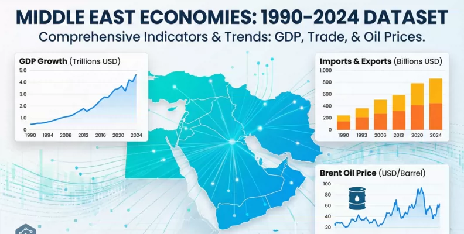
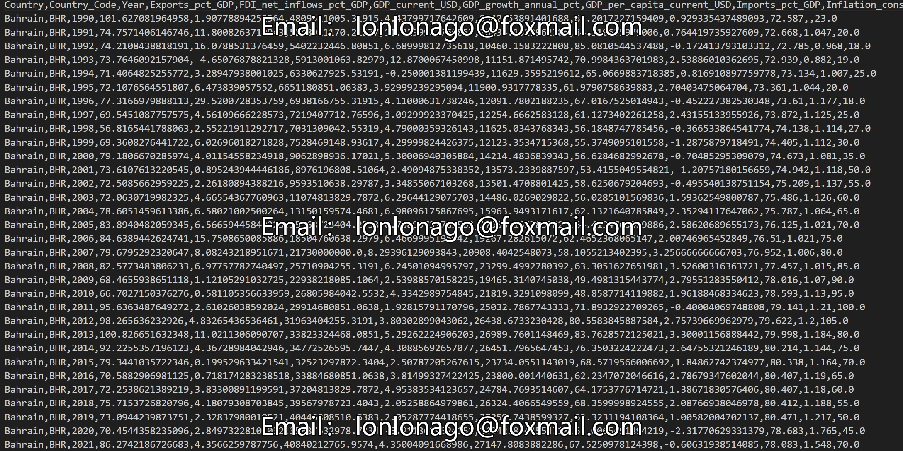

## Body

中东经济与油价（1990–2024）

This dataset covers the comprehensive and timely conditions of various economies in the Middle East from 1990 to 2024, combining key economic indicators with annual Brent crude oil prices. It is very helpful for analyzing current conflicts, war situations, and the impact of oil price shocks on the region's economy. It is structured as a balanced panel covering 13 countries, making it very suitable for economic research, time series analysis, forecasting, and data visualization.

Key features:
- Country - The name of the country.
- Country Code - A three-letter international standard code for the country.
- Year - Record year (1990 to 2024).
- Export Share of GDP - The percentage of total exports to GDP.
- Foreign Direct Investment Net Inflow to GDP - The percentage of foreign direct investment net inflow to GDP.
- GDP_current_USD - Local currency-adjusted GDP.
- GDP Growth Rate (%) - Annual GDP growth rate.
- GDP per Capita (Current USD) - GDP per capita calculated in current US dollars.
- Import Share of GDP - The percentage of total imports to GDP.
- Inflation - Consumer Price - Annual Percentage - Annual inflation rate (%)
- Life Expectancy (Years) - Average life expectancy at birth (years).
- Unemployment Total Pct - Total unemployment rate (percentage of the labor force).
- Brent Crude Oil Price (USD/Barrel) - Annual average price of Brent crude oil (in USD, per barrel).

## Images

Here is a pay link on Stripe ( https://buy.stripe.com/3cs8yP7sY87d0vu9AB ). Please contact me lonlonago@foxmail.com after funding $89, and I will send you a complete data files , thank you!

